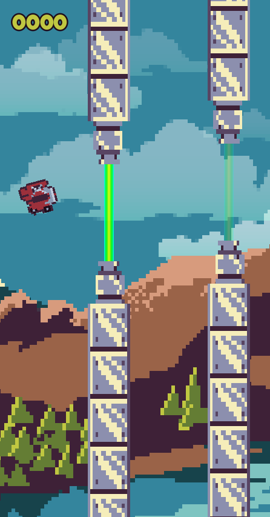

---

# Tappy Plane ✈️

A vibrant, pixel-art **Flappy Bird clone** built with **Godot 4**. Navigate your plane through an endless gauntlet of pipes, rev your engine to defy gravity, and chase that elusive high score!

## Features

* **Custom Pixel Art:** All visual assets were handcrafted by me, giving the game a unique retro aesthetic.
* **Dynamic Audio:** Features an engine "revving" system where the sound pitch increases during jumps for satisfying tactile feedback.
* **Persistent High Scores:** Utilizes Godot's **Resource** system to save your best scores in both `.tres` (text) and `.res` (binary) formats.
* **Parallax Background:** Multi-layered scrolling backgrounds to add depth to the flight experience.
* **Signal Bus Architecture:** Clean, decoupled code using a global `SignalHub` to manage game events like scoring and death.

## Technical Highlights

* **Engine:** Godot 4.x
* **Language:** GDScript
* **Architecture:** * **Singletons (Autoloads):** `GameManager` for scene switching, `ScoreManager` for data persistence, and `SignalHub` for event-driven programming.
* **Tween System:** Used extensively for UI transitions and smooth audio pitch shifting.
* **Collision Detection:** Precise hitbox management using `Area2D` and `CharacterBody2D`.

## How to Play

1. **Launch:** Press `Space` on the Main Menu to start.
2. **Fly:** Press `Space` to flap/jump.
3. **Survive:** Avoid the upper and lower pipes!
4. **Quit:** Press `Esc` at any time to return to the main menu.

## Project Structure

* `/Scenes`: Contains the game world, player, and UI scenes.
* `/Assets`: Custom pixel art textures and sound effects.
* `/Resources`: Custom `.tres` files for high score data and label settings.
* `/Scripts`: All logic handled via organized GDScripts.

---
